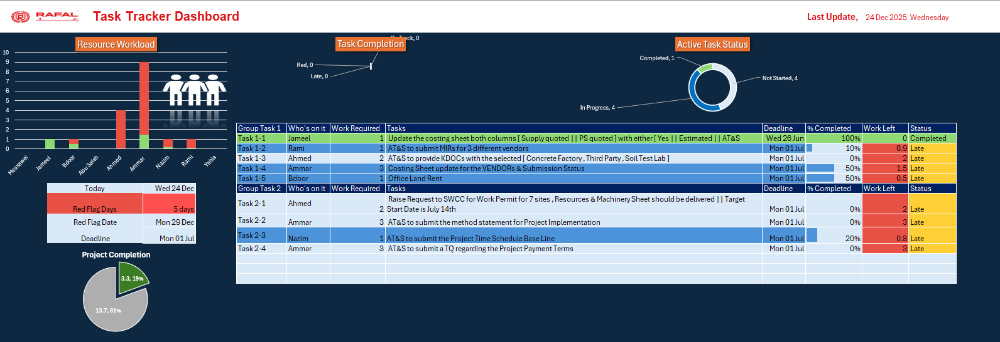

# 📁 SWA Infrastructure Projects & Task Dashboard

This repository contains :-
- Documentation and tracking files related to infrastructure work and coordination across SWA (Saudi Authority Water).
- Rports Related To Site Survey and Installation For ZATCA (Zakat , Tax and Customs Authority).  
---

## 📄 Project Documents

### 1. `Zatca and SWA Project.pdf`
📌 **Language:** Arabic  
📋 **Description:**  
A detailed technical report outlining excavation and infrastructure connection work for network and Security systems at the following locations:

For SWA :- 
- Ras AL Khair Desalination Plant.
- Khafji Desalination Plant.
- Reservoirs (Nairyah, Ibn Hithleen, Sayriah, Qaryat al Olyah, Sadawei, Qaysouma, Haf Al Batin).
- Line Valve, VDV's (Draining Valve).

For ZATCA :- 
- Airports: Taif, Yanbu, Madinah, Abha, Jazan.
- Ports: King Abdullah Port (Rabigh), Jazan Port.
- Land Port: Al Wadi’ah.

📎 **Topics Covered:**
- Site names & locations
- Excavation lengths (meters)
- Switch installation details (e.g., Port 4, Port 8)
- Custom buildings and gates involved
- Diagrams or photos (referenced in file)

🗂️ *Useful for engineering teams, planning offices, or audit purposes.*

---

### 2. `Task Tracker Dashboard-SWA.xlsx`
📋 **Description:**  
An Excel dashboard to **track tasks, timelines, and status** of work progress related to SWA projects.

📎 **Features:**
- Task status tracking (e.g., Completed, In Progress)
- Assignment per location or department
- Possibly includes dates, responsible teams, and progress metrics
- Useful for project management and reporting

💡 *This file is ideal for internal coordination, project leads, or progress meetings.*

---

## 📁 Folder Structure

